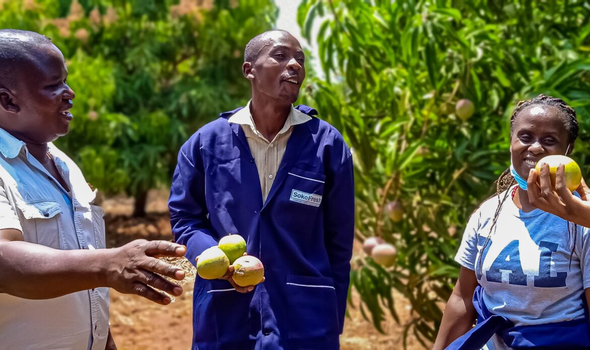
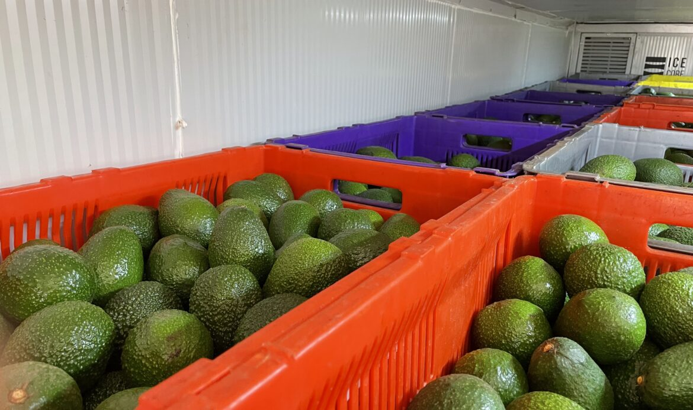

  

    
    <h2><a href="https://sokofresh.co.ke">Our Website</a></h2>  
  

    <h2 align="center" style="color: lightgreen;">Welcome to Sokofresh!</h2>

 

  

<h3 align="center">We offer experienced sourcing services for fresh fruit & vegetable buyers in East Africa.</h3>
 

  

    

      
    

    

      
    

    

      
    

  

<h2 align="center">What we do:</h2>

  

    <h3>Full Service Product</h3>
    
Professional First Mile produce handling using Solar Powered Cold Storages and market linkages

  

  

    <h3>Cold Storage Rental</h3>
    
Leverage on SokoFresh’s Rental Service to provide the most ideal aggregation infrastructure for vegetables and herbs.

  

